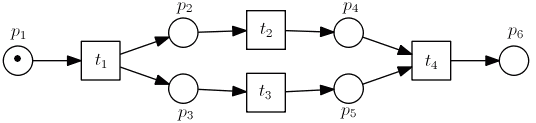
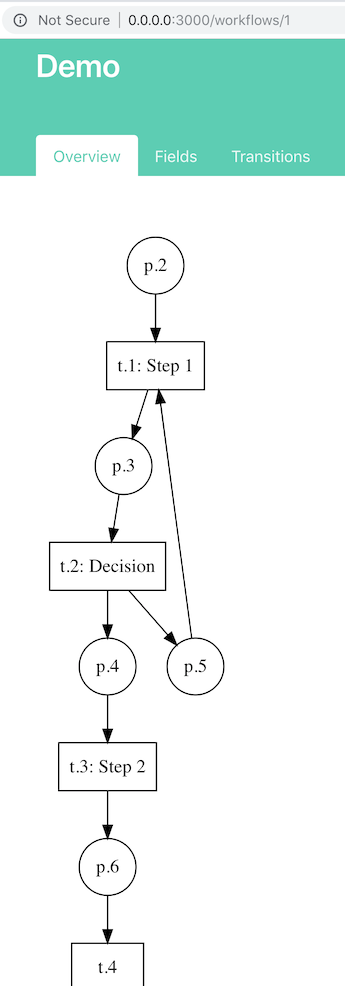
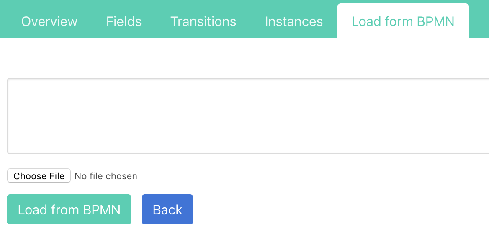
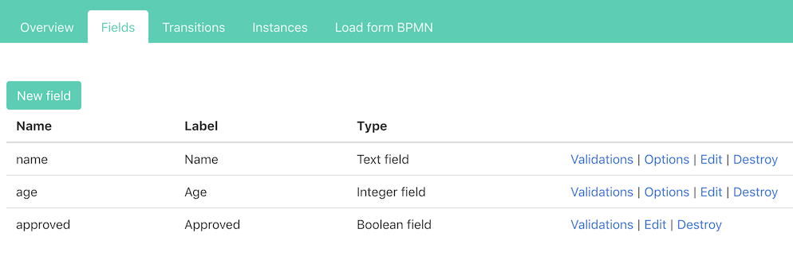

Workflow Core
====

> WorkflowCore is under development, the codebase is unoptimized and has many bad practices, I may do breaking changes even force pushing to master branch.
> 
> In short, it's not ready yet, but I realize that a workflow engine is complicated to design and it needs a long term to done well, so I decide to open source at early stage.
> 
> Any way, feedbacks and suggestions are highly welcome!

A Rails engine which providing essential infrastructure of workflow.

WorkflowCore is originally designed for Business Process Management (BPM), in this scenario:

- Workflows are usually defined by users dynamically
- Task may tight with application features
- May meet some special or weird requirements

WorkflowCore is based on [Workflow Net](http://mlwiki.org/index.php/Workflow_Nets) technique, and only providing essential features for a workflow engine.

## Features

### Models to describe workflow net

Workflow Net is a special case of [Petri net](http://mlwiki.org/index.php/Petri_Nets)



There are two kinds of nodes

- Place (circles): represent the states of a system
- Transition (squares): represent state changes

WorkflowCore provides Place & Transition models that can represent a workflow net, and a Workflow model as root.

### Models to describe workflow instances

Workflow net use Token (dots in places) to tracking states of a process, every place can contain one or more tokens.
 
WorkflowCore provides WorkflowInstance model represent processes, and it has many tokens.

### Interfaces to define how to transit

Transition has a transactional `fire` method which accept a token that would consume it and generate new token(s), developer could create many kinds of transitions and overrides `on_fire` to define how to transit

In addition, `on_error` is used for error handling.

## Why “core”

Because it's not aim to "out-of-box", some gem like Devise giving developer an out-of-box experience, that's awesome, but on the other hand, it also introducing a very complex abstraction that may hard to understanding how it works, especially when you attempting to customize it.

I believe that the gem is tightly coupled with features that face to end users directly, so having a good customizability and easy to understanding are of the most concern, so I just wanna give you a domain framework that you can build your own that just fitting your need, and you shall have fully control and without any unnecessary abstraction.

BTW, the dummy app is a full-featured app with production level codebase that you can freely to reference it.

## Todo

- Find a good way to validate all nodes of the net, when? where? how?
- Consider native workflows (those which defined in code and tight with the app) support
- Stabilizing interfaces.
- Evaluate that can supporting async, scheduled and event-based transition properly.
- Efficiency (especially database queries).
- Easy to use.
- Transforming to graph representation for visualization and other usages (e.g proving [Soundness](http://mlwiki.org/index.php/Workflow_Soundness)).
- Polish codebase.
- Continually improving dummy app.

## Requirements

- MRI 2.3+
- Rails 5.0+

## Usage

See demo for now.

## Installation

Add this line to your Gemfile:

```ruby
gem 'workflow_core'
```

Or you may want to include the gem directly from GitHub:

```ruby
gem 'workflow_core', github: 'rails-engine/workflow_core'
```

And then execute:

```sh
$ bundle
```

Copy migrations

```sh
$ bin/rails workflow_core:install:migrations
```

Then do migrate

```sh
$ bin/rails db:migrate
```

## Demo

**Demo is also under development.**

The dummy app integrates with [Form Core](https://github.com/rails-engine/form_core) and [Script Core](https://github.com/rails-engine/script_core) shows an Approving Manage System.



**You need to install Graphviz first**

Clone the repository.

```sh
$ git clone https://github.com/rails-engine/workflow_core.git
```

Change directory

```sh
$ cd workflow_core
```

Run bundler

```sh
$ bundle install
```

Build mruby engine & engine lib

```sh
$ bin/rails app:script_core:engine:build
$ bin/rails app:script_core:engine:compile_lib 
```

Preparing database

```sh
$ bin/rails db:migrate
```

Start the Rails server

```sh
$ bin/rails s
```

Open your browser, and visit `http://localhost:3000`

### Features

#### Importing workflow definitions from a BPMN2 xml,



Because there isn't have a easy-to-use web-based flowchart designer, I implement a stupid BPMN2 importer, it have many restrictions:

- Only supports `Sequence`, `Start event`, `End event`, `Parallel gateway` and `Exclusive gateway`
- Using gateway to fork flows must have corresponding join (or merge) gateway
- Only read `name` property, other such as `condition expression` must configure on the dummy app

You can check `_samples` folder, I've already provided some samples, or you can try a BPMN2 designer (e.g [Camunda modeler](https://github.com/camunda/camunda-modeler)).

#### Defining form



You can defining a dynamic form for a workflow.

In transition's options, you can configure field's accessibility

#### Exclusive choice configuration supports Ruby expression


Exclusive choice is a special transition that needs to configure conditions that determine how to transit to a branch.

The condition is a Ruby expression, and running in a mRuby sandbox (powered by [ScriptCore](https://github.com/rails-engine/script_core)),
and you can access form data through `Input`, for example, there is a field named `approved`,
we can check the field checked by `Input["approved"]`

#### Run a workflow

See `Instance` tab, that should make sense.

## Contributing

Bug report or pull request are welcome.

### Make a pull request

1. Fork it
2. Create your feature branch (`git checkout -b my-new-feature`)
3. Commit your changes (`git commit -am 'Add some feature'`)
4. Push to the branch (`git push origin my-new-feature`)
5. Create new Pull Request

Please write unit test with your code if necessary.

## License

The gem is available as open source under the terms of the [MIT License](http://opensource.org/licenses/MIT).
